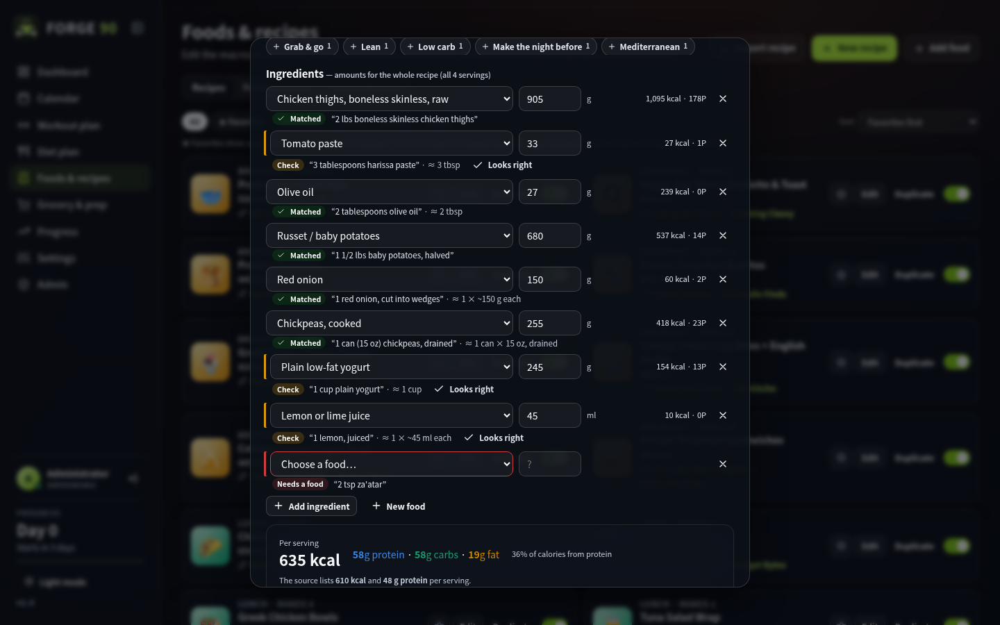
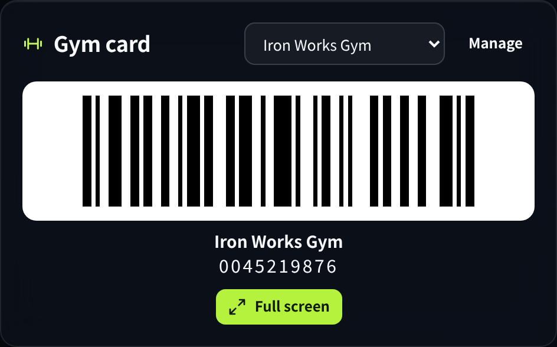

<div align="center">


# FORGE 90

A self-hosted training and meal-planning app. It builds a 90-day Push/Pull/Legs program that continues in 13-week cycles, plans meals portioned to each person's macros, and tracks weight, body fat and lifts. Accounts are invite-only, so it works well for a household on one server.


</div>

## Contents

- [Features](#features)
  - [Training](#training)
  - [Logging and the calendar](#logging-and-the-calendar)
  - [Nutrition](#nutrition)
  - [Recipes and foods](#recipes-and-foods)
  - [Importing recipes](#importing-recipes)
  - [Barcode scanning](#barcode-scanning)
  - [Groceries](#groceries)
  - [Pantry](#pantry)
  - [Meal-plan sync](#meal-plan-sync)
  - [Progress](#progress)
  - [Gym cards](#gym-cards)
  - [Accounts](#accounts)
  - [Admin console](#admin-console)
- [Installation](#installation)
  - [Configuration](#configuration)
  - [First sign-in](#first-sign-in)
- [Backups and recovery](#backups-and-recovery)
- [Security](#security)
- [License](#license)
- [Credits](#credits)

## Features

### Training

- The first 90 days run through four phases: Foundation (upper-body focus while adjusting to the deficit), Build, Intensify, and a deload and PR-test week. After that the plan repeats in 13-week cycles, and the calendar always has the current and next cycle scheduled.
- Sessions rotate Push, Pull, Legs across however many training days you pick. Push and pull never land on the same day.
- Each session mixes heavy strength sets with hypertrophy work. Targets are given in reps in reserve and change with the phase.
- Progression uses double progression: the app tells you to add weight once every set hits the top of the rep range.
- The exercise library has about 120 exercises across 11 muscle groups, each with form steps and cues. Around half are research-backed alternatives that start switched off, each with a note on why it's included. Exercises rotate weekly within their movement slot. You can switch exercises on or off (every muscle group keeps at least one) or add your own.
- Any exercise can be swapped, either in a single day's session or in the program from the current week on. Earlier weeks keep what was planned.


### Logging and the calendar

Sets are logged on the dashboard's Today card or in the day view. Weight and reps save as you type, and each exercise shows its target, PR badges and a suggestion for next time. The calendar has month and week views with drag and drop for workouts and meals, plus undo. The dashboard also has quick editors for the day's workout and meals, and **Customize** lets you rearrange its panels or hide the ones you don't use. The layout is saved to your account.


### Nutrition

Calorie targets use Katch–McArdle BMR, an activity multiplier, extra calories on lifting days, and a deficit set by the chosen loss rate. Protein is set between 0.5 and 1 g per pound of body weight, and carbs and fat make up the rest. Every day, recipe portions are scaled so the day's meals hit protein and calories, with count-based items like eggs and tortillas rounded to whole units. A trend coach compares the 7-day weight trend to the target and can adjust calories. Once the goal is reached, calories switch to maintenance. The loss rate, body and goal numbers, and nutrition settings can be changed from the Diet plan page as well as Settings.


### Recipes and foods

The app ships with 36 high-protein meal-prep recipes, each linked to its original source, and a database of about 650 foods. Multi-serving recipes are scheduled as leftovers. Recipes can be searched by name, ingredient or tag, favorited so they come up more often, filtered and sorted by macros, edited, duplicated or switched off, opened as a full page or printed, and you can write your own. Food preferences work as a checklist by group, subgroup and individual food. Unchecking a food removes recipes that use it and swaps it out of upcoming meals.


### Importing recipes

**Import recipe** on the Foods & recipes page brings in a recipe from a web link or from a Mealie server. Link import works with any site that publishes standard recipe data, which covers most recipe sites. For Mealie, an administrator adds the Mealie address and an API token under Settings → API connections, and then everyone on the server can search it and import several recipes at once.

Each ingredient is matched to a food in the database and its amount is converted to grams, milliliters or items. Every import opens for review before it's saved. Anything that couldn't be worked out, such as an ingredient with no matching food, a missing amount, the meal or the number of servings, is highlighted and has to be filled in first, and uncertain matches are marked so you can check them. Your corrections are remembered for the next import. If a page has no recipe data, you can paste the ingredient list instead.



### Barcode scanning

On a phone, **Scan** reads the barcode on a packaged food (EAN-13, UPC-A, EAN-8 and UPC-E) with the camera. Products are looked up on [Open Food Facts](https://world.openfoodfacts.org). The first time anyone scans a product, they check the name, nutrition and package size and add it to the food list, and from then on it's searchable by everyone on the server, by name, brand or barcode. Products that aren't on Open Food Facts can be entered from the label. The person who added a product, or an administrator, can correct it later.

Where you scan decides what happens:

- **Dashboard, Calendar, Day view and Foods & recipes:** the product is added to today (or the day you're viewing) as an extra food with a meal. It counts toward the day's macros, and the rest of the day's portions shrink to make room. **Add food** does the same for any food without a camera. Scanned foods can also be starred as favorites or added to today from the food list.
- **Pantry:** each scan adds one package straight to the pantry with no questions, so you can scan a bag of groceries in a row.

The live camera view needs HTTPS (or `localhost`). Over plain HTTP, Scan asks you to take a photo of the barcode instead, which opens the phone's camera and works the same way. Android Chrome uses the phone's built-in barcode reader; other browsers, including iPhone Safari, use the app's own decoder. You can always type the number under the barcode instead.


### Groceries

The weekly shopping list is grouped by aisle and adds up the exact scaled portions on the calendar, including leftovers. It comes with a batch-cook schedule. Items the pantry already covers stay on the list, ticked off with a pantry icon, so a pantry that's behind can't make you miss anything; untick one if you still need to buy it. Items the pantry only partly covers show the full amount with a note of what's at home. **Check all**, **Uncheck all** and **Add checked to pantry** make putting the shopping away quick. With money-saving planning turned on, the planner orders each week's meals so recipes share fresh ingredients. That means fewer packages and less waste, without changing variety or favorites.


### Pantry

The Pantry page keeps track of the food you have at home, with amounts and use-by dates. Items are added by scanning, by hand, or from the shopping list. New items get a typical use-by date for that kind of food, which you can change. As each planned day passes, its meals are taken out of the pantry automatically, soonest-expiring first. Anything within two weeks of its use-by date is listed under **Expiring soon**, with a count on the Pantry menu item. The pantry can be searched and sorted by aisle, name, use-by date or when items were added.


### Meal-plan sync

Two users can sync their meal plans from Account settings. One sends a request and picks which meals to share, and the other accepts. The shared meals are then re-planned together using only recipes both people can eat, and both people's favorites. Portions stay sized to each person's own targets, while the shopping list and batch-cook schedule cover both.

When either person changes a shared meal, it changes on their plan right away and is sent to the other person to accept or decline. A declined change means you each keep your own meal that day. A Sync button with a count of pending changes appears on the relevant pages while a sync is active. Either person can change which meals are shared (the other has to approve) or unsync at any time. Synced users can also choose to share one pantry in their sync settings. Both people's items move into it, scans and edits update it for both, and if sharing is turned off, each person keeps a copy.


### Progress

Charts for body weight (with a 7-day average and the plan line), body fat and lean mass, and a strength chart per exercise with estimated one-rep max and PR detection.


### Gym cards

Add your gym membership card in Settings → Gym cards, or from the dashboard, and its barcode shows on the dashboard for check-in. Scan the barcode on the card or key tag, or type the number. Code 128, Code 39, Codabar, Interleaved 2 of 5, EAN/UPC and QR codes are supported. Scanning picks the type automatically; when you type the number, Automatic works with most gym scanners, or you can choose the type your card uses. Tap the barcode for a full-screen view that keeps the screen awake. You can keep several cards and switch between them on the dashboard. QR codes can be scanned from the card only on phones with a built-in barcode reader, such as Android; on other phones, type the text instead.



### Accounts

There is no public sign-up. An administrator invites people by email, and the invite link works once and expires after 7 days. Users can reset a forgotten password by email (the link lasts 30 minutes). Accounts lock after repeated failed sign-ins, and the owner is emailed a reset link. Each user can manage their profile and profile picture, password and signed-in devices, export or import their data, and delete their account.

### Admin console

- **Users:** invite people, resend or revoke invites, grant or remove admin rights, unlock accounts, send reset links, set temporary passwords, and delete accounts.
- **Security:** password rules, lockout, session length and Require HTTPS.
- **App settings:** the app name (used in emails and the browser tab) and the app address used in email links.
- **Email:** SMTP settings, with a test send.
- **Server & proxy:** checks how the current connection reaches the app (HTTPS, the client IP it sees, secure cookies) and points out any proxy settings that need changing.
- **Activity log** and **Data & backup:** a filterable log of sign-ins and admin actions, and a full JSON export.


## Installation

The image is published to GitHub Container Registry:

```
ghcr.io/oroshi-zz/forge_90:latest
```

The container listens on port `8090`. Mount `/app/data` to persistent storage. An Unraid template is included at `unraid/forge90.xml`.

### Configuration

| Variable | Default | Description |
|---|---|---|
| `APP_URL` | request host | Public address, used in invite and reset links and as the Require HTTPS redirect target. |
| `PORT` | `8090` | Listening port inside the container. |
| `DATA_DIR` | `/app/data` | Data location. |
| `ADMIN_EMAIL` | `admin@forge90.local` | Default administrator, created on first start. |
| `ADMIN_PASSWORD` | `forge90-admin` | Default administrator password. It must be changed at first sign-in. |
| `SMTP_HOST` | `smtp.gmail.com` | Mail server. |
| `SMTP_PORT` | `465` | Mail server port. |
| `SMTP_SECURITY` | `tls` | `tls`, `starttls` or `none`. |
| `SMTP_USER` | | Mail account username. |
| `SMTP_PASS` | | Mail account password. |
| `MAIL_FROM` | `SMTP_USER` | From address. |
| `MAIL_FROM_NAME` | `FORGE 90` | From name. |
| `TRUST_PROXY` | off | Addresses of your reverse proxy (IPs or CIDR ranges, comma-separated), or `true` to trust any. Forwarded headers are ignored from anywhere else. |
| `IMPORT_ALLOW_PRIVATE` | `false` | Lets link import reach private network addresses, for recipe sites on your own network. |
| `OFF_URL` | `https://world.openfoodfacts.org` | Where barcode lookups go, if you use an Open Food Facts mirror. |
| `REQUIRE_HTTPS` | auto | When `APP_URL` is https, plain-HTTP requests on any other host are redirected to it and HSTS is sent. Set to `false` to disable. |
| `COOKIE_SECURE` | `auto` | Marks the session cookie Secure when the request is HTTPS. |
| `TZ` | `UTC` | Time zone used in emails. |

The email settings can also be changed from Admin → Email. Invites and password resets are sent by email, so set up email before inviting anyone.

### First sign-in

Sign in with `admin@forge90.local` / `forge90-admin` (or your `ADMIN_EMAIL` / `ADMIN_PASSWORD`). You'll be asked to set a new password and a real email address, and then you'll go through the questionnaire. After that, invite users from Admin → Users.

## Backups and recovery

Everything lives in the data folder:

- `db.json`: accounts, sessions, invites, settings and the activity log
- `state/`: each user's plan
- `avatars/`: profile pictures
- `foods.json`: products added by scanning, shared by everyone
- `sync/`: shared-meal data for synced users

To back up, copy the folder while the container is stopped. Admin → Data & backup also downloads a JSON export of all accounts and plans, but without password hashes, so it's a record rather than a full restore. Individual users can export and import their own plan from Account settings.

If you're locked out of the only admin account, stop the container and run a one-off copy of the image against the same data folder:

```bash
docker run --rm -v /path/to/data:/app/data ghcr.io/oroshi-zz/forge_90:latest \
  node server.js --set-password you@example.com "new-password"

# or promote an existing account
docker run --rm -v /path/to/data:/app/data ghcr.io/oroshi-zz/forge_90:latest \
  node server.js --make-admin you@example.com
```

## Security

- Passwords are hashed with scrypt. Session, invite and reset tokens are random 256-bit values stored only as hashes.
- Cross-site requests are blocked, and responses carry a strict Content Security Policy.
- Sign-in, reset and invite endpoints are rate-limited per IP, and accounts lock after repeated failures. The forgot-password form gives the same response whether or not the account exists.
- Behind a proxy, the client IP comes from the entry your proxy added to `X-Forwarded-For`, so a client can't dodge rate limits by sending its own header.
- Synced users only see each other's shared meals and portions.
- Profile pictures are cropped and re-encoded in the browser, checked on the server, and only shown to signed-in users. Uploading a new one deletes the old file.
- Link import only reaches public addresses, so it can't be used to probe your network. The Mealie token stays on the server and is never sent to the browser.
- Gym card numbers are saved with the user's plan and aren't shared with sync partners.
- Barcodes are decoded on the phone, and camera images never leave it. Lookups go through the server, so Open Food Facts only sees the barcode number.

## License

FORGE 90 is licensed under the GNU Affero General Public License v3.0 or later. See [LICENSE](LICENSE). If you run a modified version for other people, the AGPL requires you to offer them its source; change `SOURCE_URL` in `src/ui-core.js` to point at your copy.

## Credits

Background photos are from Unsplash: Victor Freitas, Jorge Alberto Vega Barrera, Mina Rad, Shan A. Rajpoot, Rodrigo Rodrigues, Jason Briscoe, Vitaly Gariev, Jakob Owens, Alina Rubo, and Jonathan Borba for the sign-in page. Food values are approximations based on USDA FoodData Central. Product data for scanned barcodes comes from Open Food Facts contributors under the Open Database License. Recipe links go to their original authors.

FORGE 90 is a planning tool, not medical advice.
